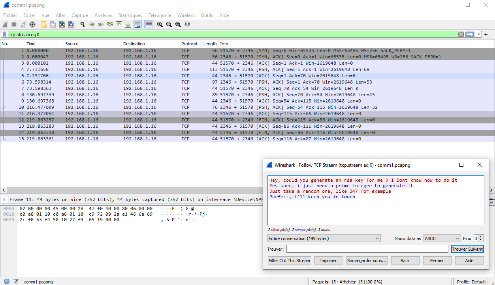
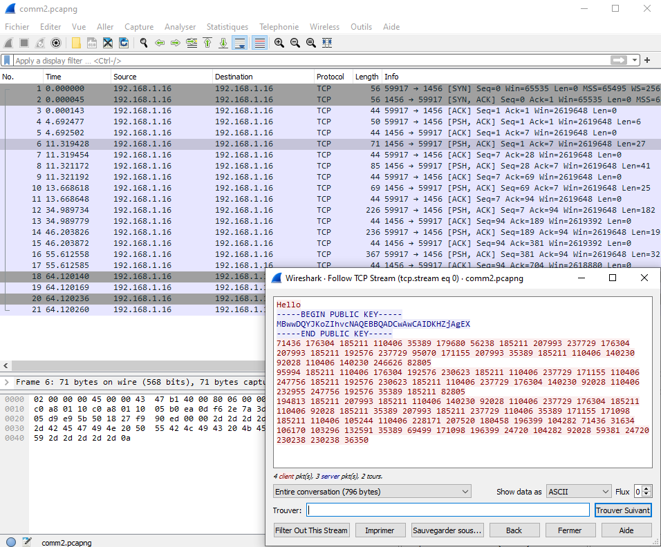
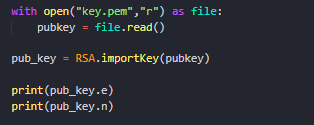
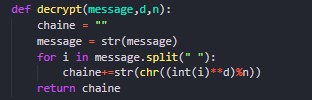
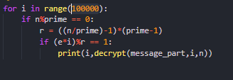
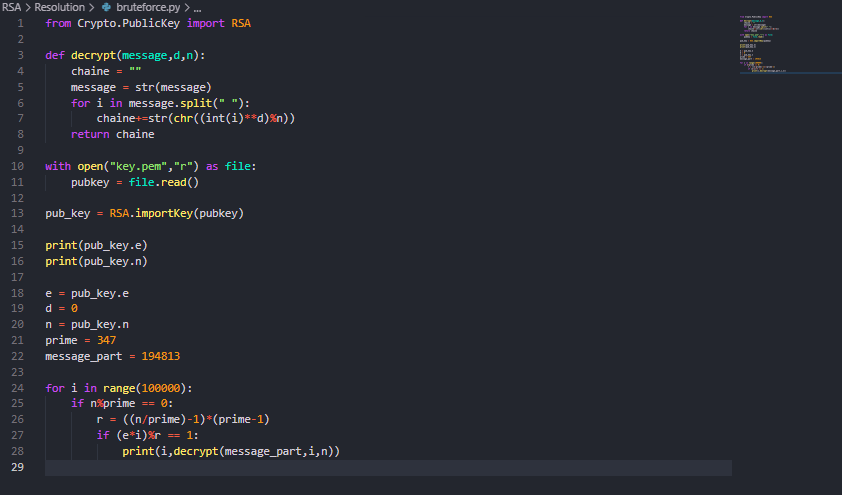
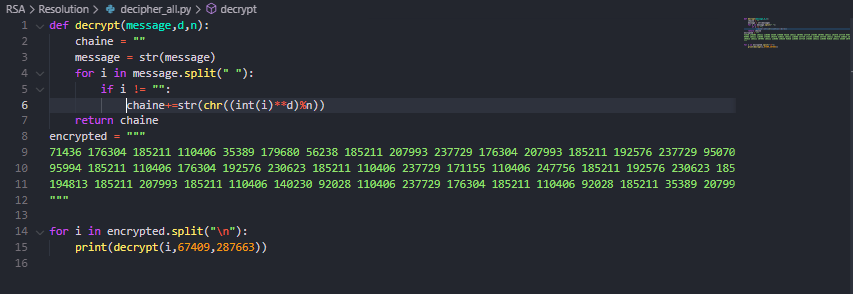

# **Writeup**

## **Etape 1 : Extraction des données**

### Comm1:



En suivant le flux tcp de la trame, on decouvre qu'une discussion en ligne non chiffrée a été interceptée.
Cette discussion nous apprend que pour le chiffrement, la personne concernée a utilisé un entier premier, afin de creer son chiffrement RSA.

### Comm2:



En suivant le flux tcp de la trame, on decouvre qu'une autre discussion en ligne a été interceptée. Celle-ci est pour cette fois chiffrée. On se doute que le chiffrement utilisé est le RSA, dont nous avons la clef qui a permis de chiffrer le message.

## **Etape 2 : Exploitation**


### **Explications :**


Afin de trouver la clef qui nous permettrai de dechiffrer le trame, nous allons faire un programme. Mais avant ca, quelques explication.


afin de chiffrer/dechiffrer un element chiffré en rsa il faut plusieurs choses :

* 2 entiers premiers (p et q)
* 1 modulus : p*q
* 1 nombre r qui permettra de generer une liste de potentielles clef publiques/privée, issu de (p-1)(q-1)
* 1 nombre k tel que k=1(mod r) et qui peut etre factorisé
* 2 nombres e et d (clef de chiffrement/dechiffrement) qui sont des facteurs resultants a K et qui valident e*d = 1(mod r)

Nous pourrons ensuite chiffrer une lettre, par exemple, en trouvant son equivalence en decimal et en utilisant la relation suivante:

```
message^e ≡ cipher(mod n)
```


Afin de dechiffrer cette chaine nous devrons ensuite utiliser cette relation:

```
cipher^d ≡ message(mod n)
```

On peut noter que le rsa est asymetrique puisque le chiffrement ne se fait pas avec la meme clef que le dechiffrement.
Nous allons donc creer un programme pour bruteforcer le dechiffrement d'un des blocs.


### **Programme :**

Nous allons d'abord recuperer le modulus et la clef de chiffrement depuis le certificat.



La premiere ligne nous permet d"ouvrir le certificat. La seconde de le lire. La 3 eme ligne permet d'importer le certificat. Nous pouvons ensuite extraire e et n du certificat etant donné qu'ils sont des objets de l'instance pub_key.

Apres avoir extrait e et n, nous allons creer une fonction qui nous permettra de dechiffrer un bloc.



Dans cette partie du script nous ne faisons qu'appliquer la formule presentée plus haut.

Apres avoir crée une fonction de dechiffrement d'un bloc, il faut faire en sorte que d soit variable et de plus en plus grand, afin de mener a bien notre bruteforce. Pour cela nous allons faire une boucle for en partant du principe que d<100000.



La premiere ligne permet de creer une boucle. La seconde ligne permet de verifier que le nombre prime (le nombre trouvé dans la premiere comm), est bien diviseur de n. Si cela est le cas il est alors potentiellement un des deux entiers qui composent r. On part donc du principe que p=n/prime etant donné la relation qui permet de generer r ((p-1)(q-1)). Ensuite nous verifions si la valeur contenue dans i (qui varie de 0 a 99 000) pourrait etre la bonne clef de dechiffrement. Si la clef est valide alors on essaye de dechiffrer le bloc avec celle ci.

Afin de resoudre ce challenge, nous allons reunir toutes ces etapes, et faire tourner le script.

Le script entier devrait ressembler a cela:




On le fait ensuite tourner avec comme bloc un bloc choisi aleatoirement dans la liste de blocs que composent le message chiffré.

Ce qui nous donne (avec mon bloc):

```
17
287663
67409 H
```

Qui signifie que ce bloc chiffré correspond a la lettre H et que la clef de dechiffrement est : 67409.

Grace a cette information nous pouvons deduire que la paire de clefs privées est : (67409,287663).

On peut ensuite dechiffrer toute la trame avec cette paire de clefs, et grace a la relation :
```
cipher^67409 ≡ message(mod 287663)
```

### **Resolution:**

On fait un script qui permet de dechiffrer toute la trame avec les informations trouvée:



Apres execution du script nous trouvons :

```
The cyberthreatforce is in.
We have to leave this place.
Here is the secret code : <redacted>
```


#

## **Felicitation vous avez fini ce challenge de Reseau/Cryptographie**
#